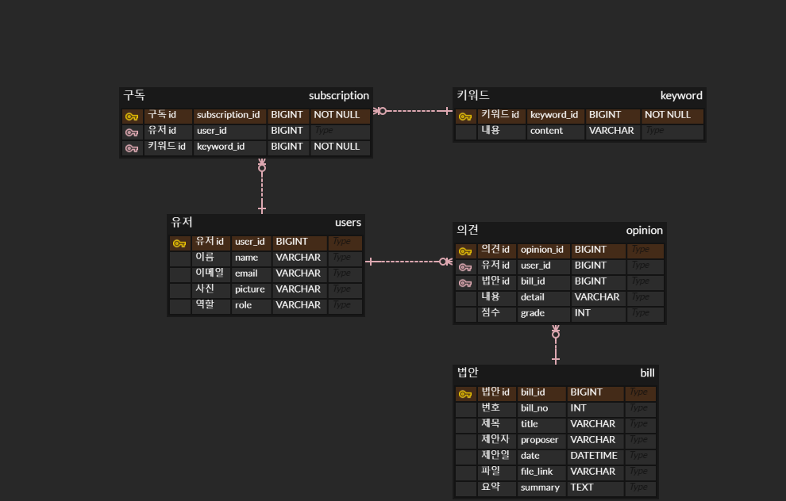

# Allaw Backend Service

## 개요

Allaw Service는 ElasticSearch와 OpenAI GPT 모델을 활용하여 법안 정보를 효율적으로 검색하고 요약하며, 법안에 대한 질의응답과 의견 작성 기능을 제공합니다. 이를 통해 사용자는 법안 정보를 쉽고 빠르게 접근하고, 법안에 대한 이해도를 높일 수 있습니다.

---
## 주요 기능

1. **GPT 기반 법안 요약 및 Q&A**
  - 법안 내용 요약
  - 법안 기반 질의응답
  - 일반 질문에 대한 GPT 모델 답변
2. **의견 관리**
  - 법안에 대한 의견 작성, 조회, 수정, 삭제

## 프로젝트 구조 개선
프로젝트 종료 후, 코드 품질 개선을 위해 다음과 같은 리팩토링을 진행하였습니다:
1. **의존성 관리 및 패키지 구조 개선**
  - 불필요한 의존성 제거
  - 도메인 기반 패키지 구조 적용
2. **클래스 분리 및 책임 명확화**
  - 단일 책임 원칙(SRP) 적용하여 클래스 분리
  - 각 클래스의 역할과 책임 명확화
3. **RESTful API 엔드포인트 개선**
  - 엔드포인트 네이밍 및 구조 개선
  - DTO(Data Transfer Object) 적용
  - 적절한 HTTP 메서드 및 상태 코드 사용
4. **예외 처리 강화**
  - 사용자 정의 예외 클래스 생성
  - 예외 발생 시 적절한 응답 반환

---
## API 명세

### GPT 관련

| 기능                  | 메서드 | Endpoint                  | 설명                                               |
|-----------------------|--------|---------------------------|----------------------------------------------------|
| 법안 요약             | POST   | /api/gpt/{billId}/summary | 지정된 법안 ID에 해당하는 법안 문서를 요약합니다. |
| 법안 기반 질문 답변   | POST   | /api/gpt/{billId}/chat    | 지정된 법안 ID에 해당하는 법안 내용을 기반으로 사용자의 질문에 답변합니다. |
| 일반 질문             | POST   | /api/gpt/query            | 일반적인 질문에 대해 GPT 모델의 답변을 반환합니다. |
| 동의 의견 추가        | POST   | /api/gpt/agree            | 후보의 공약에 대한 동의 의견을 추가합니다. |
| 반대 의견 추가        | POST   | /api/gpt/disagree         | 후보의 공약에 대한 반대 의견을 추가합니다. |

### 의견 관리

| 기능        | 메서드 | Endpoint            | 설명                           |
|-------------|--------|---------------------|--------------------------------|
| 의견 추가   | POST   | /api/opinions       | 새로운 의견을 추가합니다.      |
| 의견 조회   | GET    | /api//bill/{billId}       | 지정된 법안 ID에 해당하는 모든 의견을 조회합니다.        |
| 의견 수정   | PUT    | /api/opinions/{id}  | 지정된 ID의 의견을 수정합니다. |
| 의견 삭제   | DELETE | /api/opinions/{id}  | 지정된 ID의 의견을 삭제합니다. |

### 구독 관리

| 기능        | 메서드 | Endpoint               | 설명                                |
|-------------|--------|------------------------|-------------------------------------|
| 구독 추가   | POST   | /subscribe             | 키워드를 구독합니다.                |
| 구독 삭제   | DELETE | /unsubscribe/{keywordId}| 지정된 키워드 ID의 구독을 취소합니다. |
| 구독 조회   | GET    | /subscriptions         | 현재 사용자의 모든 구독을 조회합니다. |

---
## 기술 스택
- Java 17
- Spring Boot 3
- Spring Data JPA
- Gradle
- MySQL

---
## ERD (Entity-Relationship Diagram)

